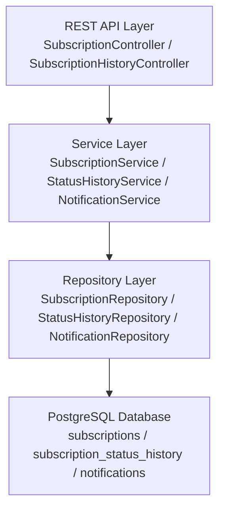

# Сервис управления пользовательскими подписками
## 1. Общее описание
### Разработан сервис для управления подписками пользователей на различные сервисы. Сервис предоставляет REST API для создания, обновления, отмены и приостановки подписок, а также автоматическое управление жизненным циклом подписок с помощью планировщика.

| Компонент | Технология |
|-----------|------------|
| Язык | Kotlin 2.2.21 |
| Фреймворк | Spring Boot 4.0.6 |
| База данных | PostgreSQL 17 |
| ORM | Spring Data JPA / Hibernate |
| Миграции | Liquibase / SQL скрипты |
| Тестирование | JUnit 5, Testcontainers |
| Документация API | SpringDoc OpenAPI (Swagger) |
| Контейнеризация | Docker, Docker Compose |




# Модель данных

### Таблица subscriptions

| Колонка | Тип | Описание |
|---------|------|-----------|
| id | UUID | Первичный ключ |
| user_id | UUID | ID пользователя |
| service_name | VARCHAR(255) | Название сервиса |
| status | VARCHAR(50) | Статус подписки |
| description | TEXT | Описание |
| cost | NUMERIC(10,2) | Стоимость |
| start_at | TIMESTAMPTZ | Дата начала |
| end_at | TIMESTAMPTZ | Дата окончания |
| created_at | TIMESTAMPTZ | Дата создания |
| updated_at | TIMESTAMPTZ | Дата обновления |
| version | BIGINT | Версия (оптимистическая блокировка) |

### Таблица subscription_status_history

| Колонка | Тип | Описание |
|---------|------|-----------|
| id | UUID | Первичный ключ |
| subscription_id | UUID | Ссылка на подписку |
| old_status | VARCHAR(50) | Предыдущий статус |
| new_status | VARCHAR(50) | Новый статус |
| changed_at | TIMESTAMPTZ | Дата изменения |
| changed_by | VARCHAR(50) | Кто изменил  |

### Таблица notifications

| Колонка | Тип | Описание |
|---------|------|-----------|
| id | UUID | Первичный ключ |
| subscription_id | UUID | Ссылка на подписку |
| message | TEXT | Текст уведомления |
| scheduled_at | TIMESTAMPTZ | Запланированная дата отправки |
| sent_at | TIMESTAMPTZ | Фактическая дата отправки |
| created_at | TIMESTAMPTZ | Дата создания |


## 5. API Endpoints

### Основные операции

| Метод | URL | Описание |
|-------|-----|----------|
| POST | `/api/v1/subscriptions` | Создание подписки |
| GET | `/api/v1/subscriptions/{id}` | Получение подписки по ID |
| GET | `/api/v1/subscriptions` | Список с фильтрацией и пагинацией |
| PATCH | `/api/v1/subscriptions/{id}` | Частичное обновление |
| PATCH | `/api/v1/subscriptions/{id}/status` | Изменение статуса |
| POST | `/api/v1/subscriptions/{id}/cancel` | Отмена подписки |
| POST | `/api/v1/subscriptions/{id}/pause` | Приостановка |
| POST | `/api/v1/subscriptions/{id}/resume` | Возобновление |
| POST | `/api/v1/subscriptions/{id}/renew` | Продление |
| GET | `/api/v1/subscriptions/users/{userId}/active` | Активные подписки пользователя |

### История статусов

| Метод | URL | Описание |
|-------|-----|----------|
| GET | `/api/v1/subscriptions/{id}/history` | История статусов (пагинация) |
| GET | `/api/v1/subscriptions/{id}/history/latest` | Последнее изменение |
| GET | `/api/v1/subscriptions/{id}/history/count` | Количество изменений |

### Уведомления

| Метод | URL | Описание |
|-------|-----|----------|
| GET | `/api/v1/subscriptions/{id}/notifications` | Уведомления для подписки |

## 6. Параметры фильтрации и пагинации

### Параметры пагинации (Query parameters)

| Параметр | Тип | Описание | Пример |
|----------|-----|----------|--------|
| page | int | Номер страницы (с 0) | `0` |
| size | int | Количество элементов на странице | `20` |
| sort | string | Поле и направление сортировки | `createdAt,desc` |


## 7. Жизненный цикл подписки
## Правила переходов

| Текущий статус | Доступные переходы |
|----------------|-----------------|
| ACTIVE | PAUSED, CANCELLED, EXPIRED |
| PAUSED | ACTIVE, CANCELLED |
| CANCELLED |  (терминальный) |
| EXPIRED |  (терминальный) |

## 8. Планировщики

### Истечение подписок (SubscriptionScheduler)

- **Запускается с фиксированной задержкой** (по умолчанию 60 секунд)
- **Находит активные подписки** с `end_at < NOW()`
- **Использует `FOR UPDATE SKIP LOCKED`** для безопасной параллельной обработки
- **Переводит найденные подписки** в статус `EXPIRED`
- **Записывает изменения** в историю

### Отправка уведомлений (NotificationScheduler)

- **Запускается с фиксированной задержкой** (по умолчанию 60 секунд)
- **Находит неотправленные уведомления** с `scheduled_at <= NOW()`
- **Использует `FOR UPDATE SKIP LOCKED`** с `LIMIT`
- **Логирует отправку** в консоль (можно расширить для реальных каналов)

---

## 9. Блокировки

### Пессимистическая блокировка (для планировщиков)

```sql
SELECT * FROM subscriptions 
WHERE status = 'ACTIVE' AND end_at < :now
ORDER BY end_at ASC
LIMIT :batchSize
FOR UPDATE SKIP LOCKED
```

### Оптимистическая блокировка (для обновлений)

```kotlin
@Version
@Column(name = "version", nullable = false)
var version: Long = 0
```

#### Назначение: Используется для защиты от конкурентных обновлений одной подписки.


## Запуск
```bash

Основной:

# LINUX / MAC
./gradlew bootJar

# WINDOWS
gradlew.bat bootJar


docker compose up -d

Тесты:
docker-compose -f docker-compose.test.yml up --build
```